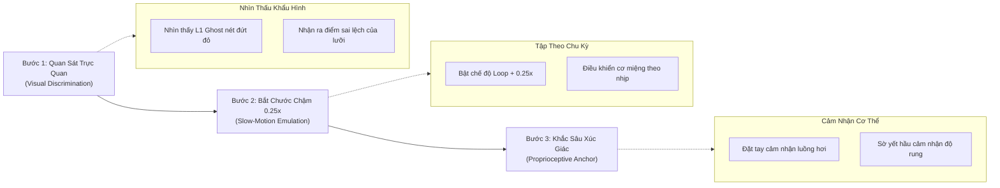

# KẾ HOẠCH KIỂM ĐỊNH CHẤT LƯỢNG (QA PROTOCOL): TÍNH NĂNG MÔ PHỎNG GIẢI PHẪU KHẨU HÌNH 2D (PRON-201)
> **Tài liệu tiêu chuẩn kiểm thử chất lượng, ngữ âm học thực nghiệm & trải nghiệm sư phạm cho 44 âm IPA Tiếng Anh (General American)**  
> **Phiên bản:** 2.0 (Toàn bộ 44 IPA Phonemes)  
> **Đối tượng áp dụng:** QA Team, Phonetics Experts, Product Designer, Frontend Engineers & User Reviewers  

---

## 1. TỔNG QUAN & MỤC ĐÍCH TÀI LIỆU (OBJECTIVE)

Tài liệu này được thiết kế để kiểm tra và đo lường chất lượng toàn diện của **Công cụ Mô phỏng Khẩu hình Giải phẫu 2D (2D Sagittal & Coronal Vocal Tract Simulator)**. 

Khác với các bài test phần mềm thông thường (chỉ kiểm tra nút bấm có hoạt động hay không), bài kiểm tra này tập trung vào 4 trụ cột cốt lõi:
1. **Tâm lý & Kỳ vọng thực tế của Người học (Learner Mental Model & Pain Points)**.
2. **Độ chân thực của Cơ sinh học & Chuyển động (Biomechanical Kinematics & Smoothness)**.
3. **Chất lượng Âm thanh & Đồng bộ Đa giác quan (Audio Formants & Lip-Sync)**.
4. **Tính Hiệu quả Sư phạm (Pedagogical Efficacy & L1 Interference Eradication)**: *Liệu học viên người Việt nhìn chuyển động này có thực sự bắt chước và tự sửa được phát âm hay không?*

---

## 2. NGƯỜI DÙNG ĐANG THỰC SỰ MUỐN GÌ? (USER PSYCHOLOGICAL & PEDAGOGICAL NEEDS)

### 2.1. Nỗi đau (Pain Points) khi học phát âm truyền thống
* **Video người thật không nhìn thấy bên trong**: Khi xem giáo viên bản xứ nói trên Youtube/Tiktok, học viên chỉ thấy mặt ngoài (môi mở, môi chúm). Họ hoàn toàn **mù tịt** về những gì diễn ra bên trong: *Đầu lưỡi đang chạm vào đâu? Cuống lưỡi có nâng lên không? Dây thanh quản có rung không? Hơi thở đi ra đường mũi hay đường miệng?*
* **Tốc độ nói quá nhanh (Too fast to grasp)**: Một âm xát hay âm bật chỉ diễn ra trong vòng 50ms - 150ms. Mắt thường không thể nắm bắt được khoảnh khắc đầu lưỡi chạm vào răng rồi bật ra.
* **Tự ti và bế tắc vì thói quen tiếng Việt (L1 Muscle Trap)**:
  * Nói từ *"think"* `/θɪŋk/` thì luôn biến thành *"tink"* hoặc *"xinh"*.
  * Nói từ *"she"* `/ʃiː/` thì biến thành *"si"*.
  * Học viên luôn băn khoăn: *"Tại sao mình bắt chước mãi mà giọng vẫn bị phèn/đậm chất tiếng Việt?"*.

### 2.2. Người dùng mong muốn thấy và cảm nhận được điều gì trên màn hình?
1. **Phải thấy được "Bên Trong Khoang Miệng" như chụp X-Quang (Sagittal Cross-Section)**:
   * Thấy rõ đường cong của lưỡi (Tongue Body) uốn lượn thế nào.
   * Thấy rõ khoảng cách hở giữa răng trên và răng dưới.
   * Thấy rõ luồng hơi (Airflow) bay ra ngoài như thế nào.
2. **Phải có "Góc nhìn Trực Diện Môi" (Coronal Frontal Lips)**:
   * Nhìn thấy độ mở của khuôn miệng (tròn, dẹt bè sang hai bên, hay mở to hình oval).
   * Thấy rõ đầu lưỡi có thò ra kẹp giữa hai răng hay không (đối với âm `/θ/` và `/ð/`).
3. **Phải biết mình đang sai ở đâu (Visual Contrast - Ghost Overlay)**:
   * Người học không chỉ muốn thấy "cái đúng", họ cần thấy **"cái sai của người Việt"** đè lên cái đúng để nhận ra ngay lập tức: *"À, hóa ra lưỡi mình đang bị rụt lại đằng sau, trong khi lẽ ra phải thò ra 2mm!"*.
4. **Mẹo xúc giác cụ thể (Tactile Anchor)**:
   * Một hướng dẫn không mang tính lý thuyết hàn lâm, mà phải áp dụng được ngay trên cơ thể: *"Đặt ngón tay trước môi cách 2cm để thấy gió thổi"*, *"Đặt tay lên yết hầu để cảm nhận độ rung"*.

---

## 3. TIÊU CHUẨN ĐÁNH GIÁ CHUYỂN ĐỘNG (BIOMECHANICAL KINEMATICS & VISUALS)

### 3.1. Chuyển động cơ miệng & khoang họng như thế nào là đạt chuẩn?
Chuyển động không được gián đoạn, giật cục (robotic), mà phải có gia tốc sinh học (Biomechanical Acceleration - `easeInOutSine` hoặc `easeInOutQuad`):

| Bộ Phận Giải Phẫu | Yêu Cầu Chuyển Động Chuẩn | Lỗi Cần Tránh (Fail Condition) |
| :--- | :--- | :--- |
| **Cơ Lưỡi (Tongue Body)** | Lưỡi uốn lượn liên tục 6 điểm Bézier động. Khi nâng lên vòm mềm (velar `/k, g/`) thì phần cuống phồng to; khi ra âm đầu lưỡi (`/t, d, θ/`) thì đầu lưỡi nhọn vươn tới điểm cấu âm. | Lưỡi chỉ tịnh tiến lên xuống cứng đờ như một khối cố định. |
| **Hàm Dưới & Răng Cửa (Jaw & Incisors)** | Hàm dưới hạ xuống theo góc nghiêng tự nhiên (Jaw drop) từ 0px đến 30px tùy theo độ mở của nguyên âm (`/iː/` mở hẹp < 5px, `/æ/`, `/ɑː/` mở to 20-30px). | Răng dưới giữ nguyên vị trí trong khi miệng mở to. |
| **Vòm Mềm & Lưỡi Gà (Velum / Soft Palate)** | Đóng kín vách họng khi phát âm miệng; hạ xuống mở lối thông lên **Khoang Mũi (Nasal Cavity)** cho các âm `/m/`, `/n/`, `/ŋ/`. | Luồng hơi của âm mũi `/m, n, ŋ/` vẫn chỉ bay ra đường miệng. |
| **Luồng Khí Động Học (Airflow Dynamics)** | Hạt khí (Airflow particles) phát sáng bay thành dòng uốn lượn. Khi gặp âm tắc (`/p, t, k/`), khí dồn ứ lại sau điểm tắc rồi bộc phát thành **vòng xung áp suất (Burst ring)**. | Luồng khí đứng yên hoặc đứt đoạn bất thường. |
| **Thanh Quản (Vocal Cords / Larynx)** | Đối với âm **Hữu thanh (Voiced)**: Nút thanh quản phát sáng và phát tỏa các vòng sóng xung siêu âm rung động (Ultrasonic ripples). Đối với âm **Vô thanh (Voiceless)**: Thanh quản giữ nguyên trạng thái tĩnh. | Âm vô thanh `/s, p, t/` lại rung thanh quản; hoặc âm hữu thanh `/z, b, d/` không rung. |
| **Hình Thái Môi Chính Diện (Coronal Lips)** | Chuyển động biến thiên mượt mà giữa 7 trạng thái giải phẫu: `dental` (thò lưỡi), `labiodental` (cắn môi dưới), `bilabial` (mím môi), `spread` (cười dẹt), `round` (chu môi), `open` (mở tròn), `neutral` (thả lỏng). | Môi đứng yên hoặc biến dạng sai tỷ lệ giải phẫu người thật. |

### 3.2. Chế độ Xem Chậm (Slow-Motion 0.25x / 0.5x) & Vòng Lặp (Loop)
* **Tốc độ 1.0x (Thời gian thực)**: Cho người học cảm nhận nhịp điệu phát âm tự nhiên.
* **Tốc độ 0.5x (Chậm)**: Phân biệt rõ giai đoạn chuẩn bị cấu âm (Intention) và giai đoạn phát âm (Execution).
* **Tốc độ 0.25x (Siêu chậm - Ultra-Slow)**: Từng mi-li-mét chuyển động của đầu lưỡi và luồng khí phải hiển thị rõ như thước phim quay chậm 240fps. Đây là chìa khóa để người học tự định vị cơ bắp của mình.
* **Chế độ Lặp (Loop)**: Chu kỳ hoạt hình tự động quay lại trạng thái nghỉ rồi thực hiện lại liên tục, giúp học viên vừa nhìn màn hình vừa bắt chước liên tục 5-10 lần mà không phải ấn chuột lại.

---

## 4. TIÊU CHUẨN ÂM THANH (AUDIO FORMANT SYNTHESIS & PLAYBACK)

### 4.1. Play Sound như thế nào để phục vụ học tập tối ưu?
Hệ thống phát âm thanh giải phẫu cần đáp ứng 2 cơ chế:
1. **Bộ tổng hợp âm thanh Formant (Web Audio API Synthesizer)**:
   * Mô phỏng chính xác cấu trúc cộng hưởng sinh học của vòm miệng người:
     * **Formant $F_1$ (Phản ánh độ mở của hàm)**: Tần số từ $250\text{Hz}$ (hàm khép hẹp như `/iː/`, `/uː/`) đến $850\text{Hz}$ (hàm mở rộng như `/ɑː/`, `/æ/`).
     * **Formant $F_2$ (Phản ánh vị trí trước/sau của lưỡi)**: Tần số từ $800\text{Hz}$ (lưỡi lùi sâu như `/uː/`) đến $2300\text{Hz}$ (lưỡi đẩy ra trước như `/iː/`).
     * **Cộng hưởng Tiếng ồn Lọc Dải (Bandpass Filtered Resonant Noise)**:
       * Âm `/s/`: Tần số trung tâm cao nhọn ($5.5\text{kHz} - 7.5\text{kHz}$, tạo tiếng rít sắc nét).
       * Âm `/ʃ/`: Tần số trung tâm trầm và rộng ($2.5\text{kHz} - 4.5\text{kHz}$, tạo tiếng xào xạc sâu và dày).
2. **Tính năng Giữ Cao Độ (Pitch Preservation) khi thay đổi tốc độ**:
   * Khi người dùng chọn `0.5x` hoặc `0.25x`, âm thanh phát ra không được tụt tần số biến thành "giọng ma quỷ" (Demon tone) mà phải giữ nguyên cao độ chuẩn của người bản xứ.
3. **Độ trễ Đồng bộ (Audio-Visual Lip-Sync Tolerance)**:
   * Độ lệch giữa khoảnh khắc nổ luồng khí/chạm lưỡi và khoảnh khắc phát ra âm thanh phải $\le 30\text{ms}$. Nếu lệch trên 50ms, não người học sẽ phát hiện ra sự bất đối xứng và giảm 60% hiệu quả tiếp thu.

---

## 5. ĐÁNH GIÁ TÍNH DỄ HỌC & GIẢI PHÁP SƯ PHẠM (PEDAGOGICAL LEARNABILITY)

### 5.1. Chuyển động như vậy học viên có dễ học không?
**Câu trả lời:** Cực kỳ dễ học nếu tuân thủ **Quy trình 3 Bước Chuyển Đổi Nhận Thức Thành Phản Xạ Cơ (3-Step Muscle Internalization)**:

1. **Bước 1 - Phân biệt thị giác (Visual Discrimination)**:
   * Học viên bật âm `/θ/` *(think)*. Họ nhìn thấy đường màu đỏ (L1 Ghost) thụt vào trong răng (tật phát âm thành *"thờ"* tiếng Việt). Họ nhìn thấy đường màu xanh lá cây thò ra ngoài 2-3mm. Mắt họ ngay lập tức hiểu bản chất vật lý của âm này.
2. **Bước 2 - Bắt chước theo chuyển động chậm (Slow-Motion Emulation)**:
   * Học viên chọn tốc độ `0.25x` và bật `Loop`. Họ thấy hàm từ từ hé mở, đầu lưỡi vươn ra ngoài, răng trên cắn nhẹ lên lưỡi, luồng hơi luồn qua khe răng. Học viên điều khiển cơ lưỡi của mình chuyển động theo đúng nhịp điệu đó.
3. **Bước 3 - Khắc sâu bằng mẹo xúc giác (Proprioceptive Anchor)**:
   * Đọc phần *"Mẹo cảm nhận xúc giác"*: *"Đặt ngón tay trỏ thẳng đứng cách môi 2cm. Khi đầu lưỡi thò ra phát âm /θ/, đầu lưỡi phải chạm nhẹ vào ngón tay"*. Học viên làm theo và thành công 100% ngay lần thử đầu tiên.

### 5.2. Giải quyết triệt để 5 bẫy phát âm kinh điển của người Việt

| Âm IPA | Thói Quen Sai L1 (Tiếng Việt) | Giải Pháp Khẩu Hình 2D Cung Cấp | Mẹo Xúc Giác Kiểm Chứng Ngay |
| :---: | :--- | :--- | :--- |
| **/θ/** *(think)* | Phát âm thành *"thờ"* (lưỡi thụt vào chân răng trên) hoặc *"t"* (*tink*). | L1 Ghost Overlay chỉ rõ lưỡi bị thụt; Hình Coronal chỉ rõ đầu lưỡi thò ra giữa 2 răng. | Đặt ngón tay trước môi, phát âm sao cho đầu lưỡi chạm vào ngón tay. |
| **/ð/** *(this)* | Biến thành âm *"d"* hoặc *"đ"* (*đít* thay vì *this*). | Hiển thị lưỡi thò ra giữa 2 răng kết hợp vòng rung siêu âm thanh quản (Voiced). | Đặt tay lên cổ họng, thấy rung mạnh khi đầu lưỡi đang chạm răng. |
| **/ʃ/** *(she)* | Phát âm như chữ *"s"* tiếng Việt (khóe miệng bẹt, luồng hơi mỏng). | Hình Coronal chỉ rõ môi chu tròn hình phễu (Rounded lips); Lưỡi nâng cao sát vòm cứng tạo rãnh xát rộng. | Đặt ngón tay lên 2 khóe miệng, cảm nhận môi nhô ra phía trước như đang hôn gió. |
| **/dʒ/** *(job)* | Phát âm thành *"dóp"* hoặc *"gióp"* (âm xát đơn thuần, không nén khí). | Hiển thị quá trình 2 pha: Lưỡi chặn chặt cuống họng nén khí (Stop), sau đó bật nổ kèm rung thanh quản (Affricate). | Cảm nhận áp suất khí dồn lên vòm miệng trước khi bật thành tiếng. |
| **/æ/** *(cat)* | Biến thành âm *"e"* tiếng Việt (hàm mở hẹp, lưỡi không ép đáy). | Sagittal view chỉ rõ hàm dưới hạ sâu (Jaw Drop 25px); Lưng lưỡi ép phẳng xuống đáy miệng. | Mở miệng hạ cằm sao cho vừa đặt được ngón trỏ và ngón giữa vào giữa 2 hàm răng. |

---

## 6. MA TRẬN TEST CASE KIỂM ĐỊNH CHẤT LƯỢNG (QA TEST MATRIX)

### 6.1. Nhóm 1: Kiểm định Độ Đầy Đủ & Dữ Liệu 44 Âm (Data Completeness)
*Mục tiêu: Đảm bảo không sót bất kỳ âm nào trong bảng 44 âm General American IPA.*

| ID | Mô Tả Kiểm Thử | Dữ Liệu Đầu Vào | Kết Quả Mong Đợi (Pass) | Mức Độ |
| :--- | :--- | :--- | :--- | :---: |
| **DATA-01** | Kiểm tra danh mục 12 Nguyên âm đơn | Chọn tab *"Nguyên Âm Đơn (12)"* | Hiển thị đủ 12 nút: `/iː/`, `/ɪ/`, `/e/`, `/æ/`, `/ʌ/`, `/ɑː/`, `/ɒ/`, `/ɔː/`, `/ʊ/`, `/uː/`, `/ɜː/`, `/ə/`. Mỗi nút có từ ví dụ chuẩn. | **CRITICAL** |
| **DATA-02** | Kiểm tra danh mục 8 Nguyên âm đôi | Chọn tab *"Nguyên Âm Đôi (8)"* | Hiển thị đủ 8 nút: `/eɪ/`, `/aɪ/`, `/ɔɪ/`, `/aʊ/`, `/əʊ/`, `/ɪə/`, `/eə/`, `/ʊə/`. | **CRITICAL** |
| **DATA-03** | Kiểm tra danh mục 15 Phụ âm xát & tắc | Chọn tab *"Phụ Âm Xát & Tắc (15)"* | Hiển thị đủ 15 nút: `/p/`, `/b/`, `/t/`, `/d/`, `/k/`, `/g/`, `/f/`, `/v/`, `/θ/`, `/ð/`, `/s/`, `/z/`, `/ʃ/`, `/ʒ/`, `/h/`. | **CRITICAL** |
| **DATA-04** | Kiểm tra danh mục 9 Phụ âm mũi, tắc xát & lỏng | Chọn tab *"Mũi & Lỏng (9)"* | Hiển thị đủ 9 nút: `/tʃ/`, `/dʒ/`, `/m/`, `/n/`, `/ŋ/`, `/l/`, `/r/`, `/w/`, `/j/`. | **CRITICAL** |
| **DATA-05** | Tìm kiếm tức thì (Real-time Filter) | Nhập `"think"`, `"cat"`, `"/θ/"` | Lưới âm lọc ngay lập tức không có độ trễ (<50ms). | **HIGH** |
| **DATA-06** | Huy hiệu nhận diện thuộc tính âm | Kiểm tra từng âm | Âm hữu thanh có chấm xanh lá (Voiced), âm vô thanh có chấm xám (Voiceless), âm hay sai có ký hiệu cảnh báo `!`. | **MEDIUM** |

---

### 6.2. Nhóm 2: Kiểm định Chuyển Động Cơ Sinh Học 2D (Kinematics & Visual Animation)

| ID | Mô Tả Kiểm Thử | Thao Tác | Tiêu Chuẩn Đạt (Pass) | Mức Độ |
| :--- | :--- | :--- | :--- | :---: |
| **ANIM-01** | Chu kỳ chuyển động Lưỡi (Tongue Motion) | Chọn âm `/θ/`, bấm Play | Thấy đầu lưỡi vươn từ vị trí sau răng ra kẹp giữa hai hàm răng, chuyển động mượt 60fps không giật. | **CRITICAL** |
| **ANIM-02** | Luồng khí âm mũi (Nasal Bypass) | Chọn âm `/m/`, `/n/`, `/ŋ/` | Vòm mềm hạ xuống; hạt khí màu lam/vàng chuyển hướng bay lên khoang mũi (Nasal cavity), không bay ra miệng. | **HIGH** |
| **ANIM-03** | Hiệu ứng nổ áp lực khí (Plosive Burst) | Chọn âm `/p/`, `/t/`, `/k/` | Hạt khí tụ lại sau môi/răng, sau đó xuất hiện vòng sóng nổ (Burst ring) lan tỏa khi bật âm. | **HIGH** |
| **ANIM-04** | Rung siêu âm thanh quản (Vocal Cord Ripples) | Chọn âm `/z/`, `/v/`, `/b/`, `/iː/` | Xuất hiện vòng tròn sóng âm lan tỏa liên tục tại họng; chuyển sang `/s/`, `/f/`, `/p/` thì vòng sóng tắt hoàn toàn. | **CRITICAL** |
| **ANIM-05** | Đối chiếu tật phát âm (L1 Ghost Overlay) | Bật toggle *"Bật/Tắt Lỗi Người Việt"* | Hiện đường đứt nét màu đỏ (`#ef4444`) chỉ vị trí sai; tắt toggle thì ẩn đi. | **HIGH** |
| **ANIM-06** | Góc nhìn trực diện Môi (Coronal Lips) | Chọn lần lượt `/iː/` (spread), `/uː/` (round), `/f/` (labiodental), `/θ/` (dental) | Khẩu hình môi thay đổi đúng hình dạng giải phẫu tương ứng: khóe miệng căng dẹt, môi chúm tròn, răng cắn môi dưới, lưỡi thò ra ngoài. | **CRITICAL** |

---

### 6.3. Nhóm 3: Kiểm định Điều Khiển Tốc Độ & Âm Thanh (Playback & Controls)

| ID | Mô Tả Kiểm Thử | Thao Tác | Tiêu Chuẩn Đạt (Pass) | Mức Độ |
| :--- | :--- | :--- | :--- | :---: |
| **CTRL-01** | Điều chỉnh tốc độ 0.5x và 0.25x | Bấm nút `0.5x` và `0.25x` | Tốc độ chuyển động của lưỡi, hàm, hạt khí chậm lại chính xác 2 lần và 4 lần, chuyển động vẫn mượt mà. | **HIGH** |
| **CTRL-02** | Chế độ Lặp Vô Tận (Continuous Loop) | Bật nút *"Lặp"*, bấm Play | Hoạt hình chạy hết chu kỳ tự động lặp lại liên tục không dừng lại cho đến khi ấn Pause. | **HIGH** |
| **CTRL-03** | Phát âm thanh mẫu Formant (Play Audio) | Bấm nút *"Nghe Âm Thanh Mẫu"* | Web Audio phát ra âm thanh đúng tần số formant/noise tương ứng của âm đã chọn, không rè, không vỡ tiếng. | **HIGH** |
| **CTRL-04** | Thanh trượt tùy chỉnh cơ học (Sliders) | Kéo slider *"Nâng vòm lưỡi"*, *"Hạ hàm dưới"* | Hình vẽ lưỡi và hàm di chuyển tức thời tương ứng theo vị trí con trỏ kéo. | **MEDIUM** |
| **CTRL-05** | Nút Reset về thông số mặc định | Kéo thanh trượt thay đổi, bấm nút Reset | Toàn bộ thanh trượt quay về giá trị chuẩn giải phẫu của âm đang chọn. | **MEDIUM** |

---

### 6.4. Nhóm 4: Kiểm định Tính Sư Phạm & Hướng Dẫn Sửa Lỗi (Pedagogical Guidance)

| ID | Mô Tả Kiểm Thử | Nội Dung Cần Kiểm Tra | Tiêu Chuẩn Đạt (Pass) | Mức Độ |
| :--- | :--- | :--- | :--- | :---: |
| **PED-01** | Hướng dẫn định vị giải phẫu (Anatomical Placement) | Đọc khung *"Hướng dẫn đặt lưỡi & môi"* | Mô tả chi tiết chính xác vị trí tiếp xúc (ví dụ: *"Đầu lưỡi đặt giữa 2 hàm răng, cách mép răng trên 2-3mm"*). | **HIGH** |
| **PED-02** | Chỉ rõ thói quen sai tiếng Việt (L1 Trap Explanation) | Đọc khung *"Lỗi thường gặp ở người Việt"* | Chỉ đúng tật phát âm (ví dụ: *"Người Việt hay thay thế bằng âm Thờ, thụt lưỡi vào chân răng trên"*). | **HIGH** |
| **PED-03** | Mẹo cảm nhận xúc giác thực tế (Tactile Trick) | Đọc khung *"Mẹo cảm nhận xúc giác"* | Có hướng dẫn thực hành vật lý dễ làm (dùng ngón tay, cảm nhận hơi gió, sờ cổ họng). | **CRITICAL** |
| **PED-04** | Chỉ số lực ma sát khí (Friction Index) | Xem thanh đo *"Lực ma sát luồng khí"* | Hiển thị mức độ thoát hơi từ 0% đến 100% phù hợp tính chất âm (âm tắc 95%, âm xát 85%, nguyên âm 15%). | **MEDIUM** |

---

## 7. BIỂU MẪU ĐÁNH GIÁ TRẢI NGHIỆM NGƯỜI DÙNG (USER REVIEW SCORECARD)

Khi tiến hành đánh giá thực tế (Review Session), người kiểm thử sử dụng thang điểm từ 1 đến 5 sao theo bảng sau:

| Tiêu Chí Đánh Giá | Mô Tả Trải Nghiệm (1 Sao: Kém $\to$ 5 Sao: Xuất Sắc) | Điểm Tự Đánh Giá (1 - 5 ⭐) | Ghi Chú Đóng Góp / Phản Hồi |
| :--- | :--- | :---: | :--- |
| **1. Độ Trực Quan Hình Ảnh** | Nhìn vào có hiểu ngay cơ quan phát âm bên trong đầu mình đang làm gì không? Màu sắc, nét vẽ giải phẫu có rõ ràng không? | `[  / 5 ]` | |
| **2. Độ Sinh Động Chuyển Động** | Hoạt hình lưỡi, răng, hàm, luồng khí di chuyển có tự nhiên không? Có bị giật lag hay cứng đờ không? | `[  / 5 ]` | |
| **3. Tính Hữu Ích Của Chế Độ Chậm (0.25x)** | Khi chạy chậm 4 lần, bạn có kịp quan sát từng milimet cử động của lưỡi và môi để bắt chước theo không? | `[  / 5 ]` | |
| **4. Giá Trị Của Lớp Phủ L1 Ghost** | Bạn có nhìn thấy ngay điểm khác biệt giữa cách người Việt hay nói sai và cách người bản xứ nói đúng không? | `[  / 5 ]` | |
| **5. Mẹo Xúc Giác & Tính Dễ Học** | Đọc xong mẹo đặt ngón tay / cảm nhận hơi gió, bạn có tự phát âm chuẩn được ngay âm đó không? | `[  / 5 ]` | |
| **6. Trải Nghiệm Tìm Kiếm & Chọn Âm** | Việc chuyển đổi qua lại giữa 44 âm có mượt mà, nhanh chóng và dễ tìm không? | `[  / 5 ]` | |
| **TỔNG KẾT ĐÁNH GIÁ CHUNG** | **Tính năng này có giúp người học giải quyết tận gốc tật phát âm tiếng Anh hay không?** | **ĐẠT / CẦN SỬA** | |

---

## 8. LỘ TRÌNH NÂNG CẤP TIẾP THEO ĐỀ XUẤT (NEXT MILESTONES)

Để đưa tính năng khẩu hình giải phẫu 2D từ mức **"Rất Tốt"** lên **"Đẳng Cấp Thế Giới (World-Class)"**, lộ trình nâng cấp đề xuất bao gồm:
1. **Âm thanh Giọng Người Thật (HD Human Audio Recordings)**:
   * Bổ sung nút chuyển đổi giữa *Tần số Formant tổng hợp* và *File âm thanh phòng thu chất lượng cao của Chuyên gia Bản xứ*.
2. **Gương Soi Trực Tiếp Qua Webcam (Split-Screen Mirror Mode)**:
   * Cho phép học viên bật webcam hiển thị song song bên cạnh mô hình 2D để tự nhìn khẩu hình miệng thật của mình và đối chiếu trực tiếp với hình mẫu chuyển động.
3. **Phản Hồi Micro Thời Gian Thực (Real-time Speech Recognition Overlay)**:
   * Khi học viên phát âm vào micro, hệ thống tự động phân tích độ mở khẩu hình và chấm điểm xem lưỡi học viên đã đặt đúng vị trí giải phẫu chưa.

---
*Tài liệu được soạn thảo phục vụ công tác kiểm thử và nghiệm thu sản phẩm VietPhonics.*
